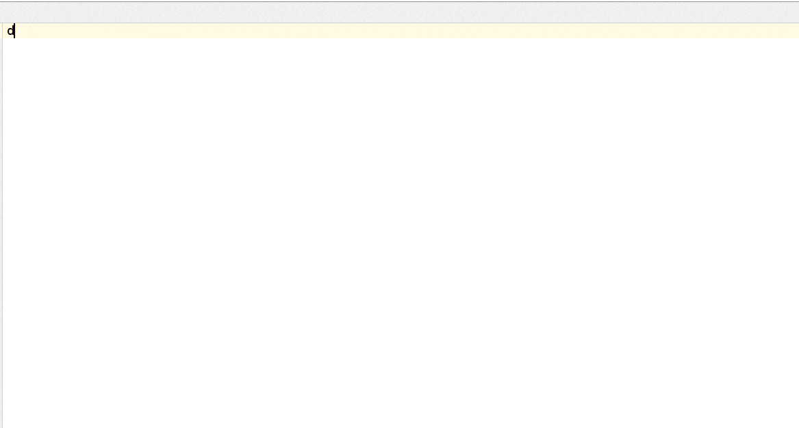

Angular material v2, Teradata covalent v1, Angular flex layout v1 & Material icon snippets for IntelliJ
===========================

A set of Angular material v2, Teradata covalent v1, Angular flex layout v1 & Material icon snippets for the following JetBrains products:

- IntelliJ IDEA
- WebStorm and PhpStorm
- PyCharm
- RubyMine

## Usage

Create a new HTML document and

1. Type `md-` followed by pressing `Ctrl+Space` to see all available angular material design snippets.
2. Type `td-` followed by pressing `Ctrl+Space` to see all available teradata covalent snippets.
3. Type `@fx` followed by pressing `Ctrl+Space` to see all available angular flex layout snippets.

Alternatively you can type `autocomplete` followed by `Ctrl+J` to see the snippet matches

Here are the conventions that will make it easy to lookup templates

1. If a tag supports multiple children, the template trigger version with `*` implies the template uses dynamic number of children `*ngFor` variation. The `*` comes from `*ngFor`
2. If a template trigger has `:**` variation, this means this variation contains the maximum number of options for that component. `**` comes from [ant](https://ant.apache.org/manual/dirtasks.html) which matches all the files under folder & sub folders
3. If a template trigger has `:?` variation, the template contains additional help that helps you completely utilize the existing templates
4. If a template trigger has `_`(underscore) variation, this is a snippet(partial) that can be added to the component. This exists mainly to avoid creating variations of all permutations for the base component
5. If a template trigger has `@` variation, this snippet targets the attribute of an html element in your markup. Think of `@` as `html attribute`
6. If a template trigger has `+` variation, this snippet allows you to specify responsive variation
7. If a template trigger has `$` variation, this snippet contains the observable variation

## Mind map
1. `*` => `*ngFor` variation
2. `@` => Targets html attribute
3. `_` => Html snippet
4. `+` => Responsive variations
5. `$` => Observable variation
6. `:**` => maximum variations
7. `:?` => Help

The detailed list of supported template triggers are listed [below](#documentation)

Feel free to let me know what else you want added via the [issues](https://github.com/1tontech/material2-snippets/issues)

Suggestions, feedback and other comments welcome via [@1tontech](https://twitter.com/1tontech) on Twitter.

## Installation (in 3 easy steps)

To install the plugin open your editor (IntelliJ) and hit:

1. `File > Settings > Plugins` and click on the `Browse repositories` button.
2. Look for `Angular material` the right click and select `Download plugin`.
3. Finally hit the `Apply` button, agree to restart your IDE and you're all done!

## Contribution guidelines

1. Clone this repo
2. To modify material templates, you can find the templates for each snippet under `snippets/material`. These html templates must follow [sublime text snippet](http://docs.sublimetext.info/en/latest/extensibility/snippets.html) format.
3. To modify covalent templates, you can find the templates for each snippet under `snippets/covalent`. These html templates must follow [sublime text snippet](http://docs.sublimetext.info/en/latest/extensibility/snippets.html) format.
3. To modify flex layout templates, you can find the templates for each snippet under `snippets/flex-layout`. These html templates must follow [sublime text snippet](http://docs.sublimetext.info/en/latest/extensibility/snippets.html) format.
4. To modify material icon templates, you can update `codepoints` under `snippets/material`. Latest version of code points can be found [here](https://raw.githubusercontent.com/google/material-design-icons/master/iconfont/codepoints)
5. If you need to change `README.md` (or) `plugin.xml`, you should modify their templates (which are used to generate the actual files) under `src/util/resources`. For eg., If you want `plugin.xml` within plugin to be modified, you should change `plugin-template.xml` under `src/util/resources`. A new `plugin.xml` & `README.md` are regenerated for every build from their corresponding templates.
7. Send me a pull request

## Changelog

See [here](CHANGELOG.md)

## Documentation

Here are available live templates

### Angular material snippets

#### Autocomplete

Trigger | Description
--- | ---
autocomplete-reactive | Autocomplete reactive
autocomplete-template | Autocomplete template

#### Button toggle

Trigger | Description
--- | ---
button-toggle | Button toggle
button-toggle-group-* | Button toggle group *forEach flavor
button-toggle-group | Button toggle group

#### Button

Trigger | Description
--- | ---
button | Button
button:color | Button + color variation
button-a | Button with link
button-a:color | Button with link + color variation
button-fab-a | Button fab with link
button-fab-a:color | Button fab with link + color variation
button-fab | Button fab
button-fab:color | Button fab + color variation
button-icon-a | Button icon with link
button-icon-a:color | Button icon with link + color variation
button-icon | Button icon
button-icon:color | Button icon + color variation
button-mini-fab-a | Button mini fab with link
button-mini-fab-a:color | Button mini fab with link + color variation
button-mini-fab | Button mini fab
button-mini-fab:color | Button mini fab + color variation
button-raised-a | Button raised with link
button-raised-a:color | Button raised with link + color variation
button-raised | Button raised
button-raised:color | Button raised + color variation

#### Card

Trigger | Description
--- | ---
card | Card
card:avatar | Card + avatar variation
card:title-group | Card:title group

#### Checkbox

Trigger | Description
--- | ---
checkbox | Checkbox
checkbox:** | Checkbox + more variations

#### Chip

Trigger | Description
--- | ---
chip-* | Chip *forEach flavor
chip-*:color | Chip *forEach flavor + color variation
chip | Chip
chip:color | Chip + color variation
chip-basic | Chip basic

#### Dialog

Trigger | Description
--- | ---
dialog | Dialog
dialog:** | Dialog + more variations
dialog:? | Dialog help

#### Divider

Trigger | Description
--- | ---
divider | Divider
divider:inset | Divider + inset variation

#### Grid

Trigger | Description
--- | ---
grid-fit-* | Grid fit *forEach flavor
grid-fit-*:footer | Grid fit *forEach flavor + footer variation
grid-fit-*:header | Grid fit *forEach flavor + header variation
grid-fit | Grid fit
grid-fit:footer | Grid fit + footer variation
grid-fit:header | Grid fit + header variation
grid-fixed-* | Grid fixed *forEach flavor
grid-fixed-*:footer | Grid fixed *forEach flavor + footer variation
grid-fixed-*:header | Grid fixed *forEach flavor + header variation
grid-fixed | Grid fixed
grid-fixed:footer | Grid fixed + footer variation
grid-fixed:header | Grid fixed + header variation
grid-ratio-* | Grid ratio *forEach flavor
grid-ratio-*:footer | Grid ratio *forEach flavor + footer variation
grid-ratio-*:header | Grid ratio *forEach flavor + header variation
grid-ratio | Grid ratio
grid-ratio:footer | Grid ratio + footer variation
grid-ratio:header | Grid ratio + header variation

#### Icon

Trigger | Description
--- | ---
icon | Icon
icon:color | Icon + color variation
icon-font | Icon font
icon-svg-set | Icon svg set
icon-svg | Icon svg

#### Input

Trigger | Description
--- | ---
input | Input
input:** | Input + more variations
input:color | Input + color variation
input-counting | Input counting
input-prefix | Input prefix
input-sufix | Input sufix
input-textarea-auto-expand | Input textarea auto expand
input-textarea-counting | Input textarea counting
input-textarea-prefix | Input textarea prefix
input-textarea-sufix | Input textarea sufix
input-textarea | Input textarea
input-textarea:* | Input textarea:*
input-textarea:color | Input textarea + color variation

#### List

Trigger | Description
--- | ---
list-* | List *forEach flavor
list | List
list:** | List + more variations
list-_avatar | List avatar snippet
list-_header | List header snippet
list-_icon | List icon snippet
list-_icon:color | List icon snippet + color variation
list-_line | List line snippet
list-_line:a | List line snippet + a variation
list-nav-* | List nav *forEach flavor
list-nav-complex-* | List nav complex *forEach flavor
list-nav-complex | List nav complex
list-nav | List nav
list-nav:** | List nav + more variations

#### Menu

Trigger | Description
--- | ---
menu-* | Menu *forEach flavor
menu-*:** | Menu *forEach flavor + more variations
menu | Menu
menu:** | Menu + more variations
menu:? | Menu help
menu-a-* | Menu with link *forEach flavor
menu-a-*:** | Menu with link *forEach flavor + more variations
menu-a | Menu with link
menu-a:** | Menu with link + more variations

#### Progress bar

Trigger | Description
--- | ---
progress-bar-buffer | Progress bar buffer
progress-bar-determinate | Progress bar determinate
progress-bar-indeterminate | Progress bar indeterminate
progress-bar-query | Progress bar query

#### Progress spinner

Trigger | Description
--- | ---
progress-spinner-determinate | Progress spinner determinate
progress-spinner-indeterminate | Progress spinner indeterminate

#### Radio

Trigger | Description
--- | ---
radio | Radio
radio-group-* | Radio group *forEach flavor
radio-group | Radio group

#### Ripple

Trigger | Description
--- | ---
ripple-@disable | Ripple attribute directive disable

#### Select

Trigger | Description
--- | ---
select-* | Select *forEach flavor
select | Select

#### Sidenav

Trigger | Description
--- | ---
sidenav | Sidenav
sidenav:** | Sidenav + more variations
sidenav:both | Sidenav + both variation
sidenav-fab | Sidenav fab
sidenav-fab:** | Sidenav fab + more variations
sidenav-fab:both | Sidenav fab + both variation

#### Slide toggle

Trigger | Description
--- | ---
slide-toggle | Slide toggle

#### Slider

Trigger | Description
--- | ---
slider | Slider
slider:** | Slider + more variations

#### Tab

Trigger | Description
--- | ---
tab-* | Tab *forEach flavor
tab | Tab
tab-nav-* | Tab nav *forEach flavor
tab-nav | Tab nav
tab-rich-* | Tab rich *forEach flavor
tab-rich | Tab rich

#### Toolbar

Trigger | Description
--- | ---
toolbar | Toolbar
toolbar:color | Toolbar + color variation
toolbar-rows | Toolbar rows
toolbar-rows:color | Toolbar rows + color variation

#### Tooltip

Trigger | Description
--- | ---
tooltip-_ | Tooltip  snippet
tooltip-_:** | Tooltip  snippet + more variations

### Angular flex layout snippets

#### Flex layout

Trigger | Description
--- | ---
@fxClass | Flex layout attribute directive fxClass
@fxFlex+ | Flex layout attribute directive fxFlex with responsive variations
@fxFlex+:** | Flex layout attribute directive fxFlex with responsive variations + more variations
@fxFlex | Flex layout attribute directive fxFlex
@fxFlex:** | Flex layout attribute directive fxFlex + more variations
@fxFlexAlign+ | Flex layout attribute directive fxFlexAlign with responsive variations
@fxFlexAlign | Flex layout attribute directive fxFlexAlign
@fxFlexFill+ | Flex layout attribute directive fxFlexFill with responsive variations
@fxFlexFill | Flex layout attribute directive fxFlexFill
@fxFlexOffset+ | Flex layout attribute directive fxFlexOffset with responsive variations
@fxFlexOffset | Flex layout attribute directive fxFlexOffset
@fxFlexOrder+ | Flex layout attribute directive fxFlexOrder with responsive variations
@fxFlexOrder | Flex layout attribute directive fxFlexOrder
@fxHide+ | Flex layout attribute directive fxHide with responsive variations
@fxHide | Flex layout attribute directive fxHide
@fxLayout+ | Flex layout attribute directive fxLayout with responsive variations
@fxLayout+:** | Flex layout attribute directive fxLayout with responsive variations + more variations
@fxLayout | Flex layout attribute directive fxLayout
@fxLayout:** | Flex layout attribute directive fxLayout + more variations
@fxLayoutAlign+ | Flex layout attribute directive fxLayoutAlign with responsive variations
@fxLayoutAlign | Flex layout attribute directive fxLayoutAlign
@fxLayoutGap+ | Flex layout attribute directive fxLayoutGap with responsive variations
@fxLayoutGap | Flex layout attribute directive fxLayoutGap
@fxLayoutWrap+ | Flex layout attribute directive fxLayoutWrap with responsive variations
@fxLayoutWrap | Flex layout attribute directive fxLayoutWrap
@fxShow+ | Flex layout attribute directive fxShow with responsive variations
@fxShow | Flex layout attribute directive fxShow
@fxStyle | Flex layout attribute directive fxStyle

### Teradata covalent snippets

#### Autocomplete chip

Trigger | Description
--- | ---
autocomplete-chip | Autocomplete chip
autocomplete-chip:** | Autocomplete chip + more variations
autocomplete-chip-readonly | Autocomplete chip readonly

#### Data table

Trigger | Description
--- | ---
data-table-!sortable | Data table !sortable
data-table-!sortable:** | Data table !sortable + more variations
data-table-@cell | Data table attribute directive cell
data-table-@column-!sortable:** | Data table attribute directive column !sortable + more variations
data-table-@column-sortable:** | Data table attribute directive column sortable + more variations
data-table-@row | Data table attribute directive row
data-table-@table | Data table attribute directive table
data-table-sortable | Data table sortable
data-table-sortable:** | Data table sortable + more variations

#### Directive

Trigger | Description
--- | ---
directive-@autotrim | Directive attribute directive autotrim
directive-@faded | Directive attribute directive faded
directive-@media-toggle | Directive attribute directive media toggle
directive-@media-toggle:** | Directive attribute directive media toggle + more variations
directive-@toggle | Directive attribute directive toggle

#### Dynamic form

Trigger | Description
--- | ---
dynamic-form | Dynamic form

#### Expansion panel

Trigger | Description
--- | ---
expansion-panel | Expansion panel
expansion-panel:** | Expansion panel + more variations
expansion-panel-richheader | Expansion panel richheader
expansion-panel-richheader:** | Expansion panel richheader + more variations

#### File input

Trigger | Description
--- | ---
file-input | File input
file-input:** | File input + more variations

#### File upload

Trigger | Description
--- | ---
file-upload | File upload
file-upload:** | File upload + more variations
file-upload:? | File upload help
file-upload-@drop | File upload attribute directive drop
file-upload-@select | File upload attribute directive select

#### Json formatter

Trigger | Description
--- | ---
json-formatter | Json formatter

#### Layout

Trigger | Description
--- | ---
layout | Layout
layout:** | Layout + more variations
layout-card | Layout card
layout-card:** | Layout card + more variations
layout-management-list$ | Layout management list with observable variation
layout-management-list$:** | Layout management list with observable variation + more variations
layout-management-list | Layout management list
layout-management-list:** | Layout management list + more variations
layout-nav-list$ | Layout nav list with observable variation
layout-nav-list$:** | Layout nav list with observable variation + more variations
layout-nav-list | Layout nav list
layout-nav-list:** | Layout nav list + more variations
layout-nav | Layout nav
layout-nav:** | Layout nav + more variations

#### Loading

Trigger | Description
--- | ---
loading:? | Loading help
loading-determinate | Loading determinate
loading-determinate:** | Loading determinate + more variations
loading-indeterminate | Loading indeterminate
loading-indeterminate:** | Loading indeterminate + more variations

#### Markdown

Trigger | Description
--- | ---
markdown | Markdown
markdown-dynamic | Markdown dynamic

#### Notification

Trigger | Description
--- | ---
notification | Notification
notification-icon | Notification icon

#### Paging

Trigger | Description
--- | ---
paging | Paging
paging:** | Paging + more variations

#### Pipe

Trigger | Description
--- | ---
pipe-bytes | Pipe bytes
pipe-bytes:** | Pipe bytes + more variations
pipe-digits | Pipe digits
pipe-digits:** | Pipe digits + more variations
pipe-time-ago | Pipe time ago
pipe-time-ago:** | Pipe time ago + more variations
pipe-time-difference | Pipe time difference
pipe-time-difference:** | Pipe time difference + more variations
pipe-truncate | Pipe truncate
pipe-truncate:** | Pipe truncate + more variations

#### Search

Trigger | Description
--- | ---
search-box-debounce | Search box debounce
search-box-debounce:** | Search box debounce + more variations
search-box-trigger | Search box trigger
search-box-trigger:** | Search box trigger + more variations
search-input-debounce | Search input debounce
search-input-trigger | Search input trigger

#### Stepper

Trigger | Description
--- | ---
stepper | Stepper
stepper:** | Stepper + more variations
stepper-_step | Stepper step snippet
stepper-_step:** | Stepper step snippet + more variations

#### Syntax highlight

Trigger | Description
--- | ---
syntax-highlight | Syntax highlight
syntax-highlight-dynamic | Syntax highlight dynamic

## License

Angular material v2, Teradata covalent v1, Angular flex layout v1 & Material icon - IntelliJ Plugin is open-sourced software licensed under the [MIT license](http://opensource.org/licenses/MIT).

## Disclaimer:

Readme template for this plugin was initially borrowed from [here](https://github.com/bodiam/intellij-bootstrap3) & [here](https://github.com/JasonMortonNZ/bs3-sublime-plugin)
